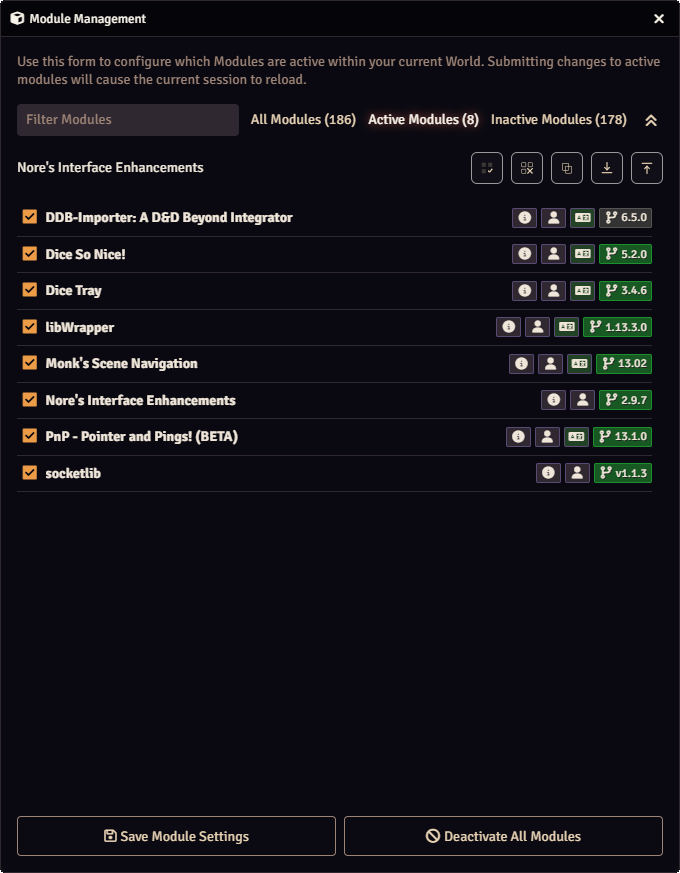
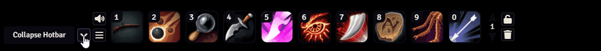

# Nore's Interface Enhancements

A lightweight set of quality of life tweaks for Foundry VTT v13. It adds a compact Module Management toolbar, a collapse button for the hotbar, options to open the sidebar at startup and choose the active tab, and a control for the Game Paused banner to place it at the top or near the bottom.

## Sidebar expanded at startup
Sidebar behavior changed in v13. The sidebar now always starts collapsed and Foundry does not provide a built in option to change that. This setting opens the sidebar automatically when the world loads, and lets you choose which tab is active or you can use the last tab you had open.

## Module Management toolbar
A compact toolbar appears above the modules list. It lets you check or uncheck boxes in bulk and export or import your active module lists.



* Check all modules
* Uncheck all except this module
* Copy active module list to clipboard
* Export active modules as JSON
* Import JSON module list

## Collapsible hotbar
Adds a small button next to the hotbar controls that hides or shows the hotbar. The button stays visible when the bar is collapsed.



* Optional setting to start collapsed
* The button sits next to the audio and menu controls
* The button stays visible when collapsed so you can reopen the hotbar

## Module settings
All options live in Game Settings under the module name.


* Auto expand the sidebar on world load
* Choose a default sidebar tab or use last open tab
* Pause banner position: Default (Center), Top, Bottom
* Enable the collapsible hotbar and choose to start collapsed

## Install

### One click install
Paste this manifest URL in Foundry's Install Module screen.

```
https://raw.githubusercontent.com/noreaga/nores-interface-enhancements/main/module.json
```

### Manual
Download the release zip and install from file.

```
https://github.com/noreaga/nores-interface-enhancements/releases/download/v2.9.8/nores-interface-enhancements-v2.9.8.zip
```

## License

MIT © 2025 Nore  
See LICENSE.md
