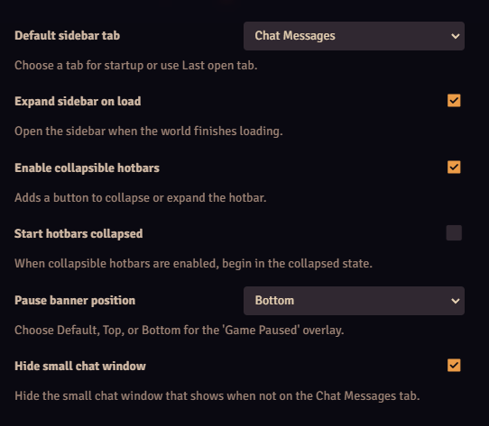

# Nore's Interface Enhancements

A lightweight set of quality of life tweaks for Foundry VTT v13. It adds a compact Module Management toolbar, a collapse button for the hotbar, options to open the sidebar at startup and choose the active tab, and a control for the Game Paused banner to place it at the top or near the bottom.

## Sidebar at startup
The sidebar can open automatically when the world is ready. You can also choose which tab becomes active or use Last open tab. Tabs include Chat, Combat, Scenes, Actors, Items, Journal, Tables, Cards, Macros, Playlists, Compendium packs, and Settings.

## Module Management toolbar
A compact toolbar appears above the list. It lets you check or uncheck boxes in bulk and export or import your active set. Press Save Modules to apply.


* Check all modules
* Uncheck all except this module
* Copy active list to the clipboard
* Export active as JSON
* Import JSON and check matching ids

## Collapsible hotbar
A native looking icon sits with the hotbar controls. Click to hide or show the bar. The toggle stays visible when collapsed.


* Optional setting to start collapsed
* Works with the system page arrows and lock and clear buttons

## Module settings
All options live in Game Settings under the module name.



* Expand the sidebar on world load
* Choose a default sidebar tab or use Last open tab
* Pause banner position: Default, Top, Bottom
* Enable the collapsible hotbar and choose to start collapsed

## Install

### One click install
Paste this manifest URL in Foundry's Install Module screen.

```
https://raw.githubusercontent.com/noreaga/nores-interface-enhancements/main/module.json
```

### Manual
Download the release zip and install from file.

```
https://github.com/noreaga/nores-interface-enhancements/releases/download/v2.9.7/nores-interface-enhancements-v2.9.7.zip
```

## License

MIT © 2025 Nore  
See LICENSE.md
